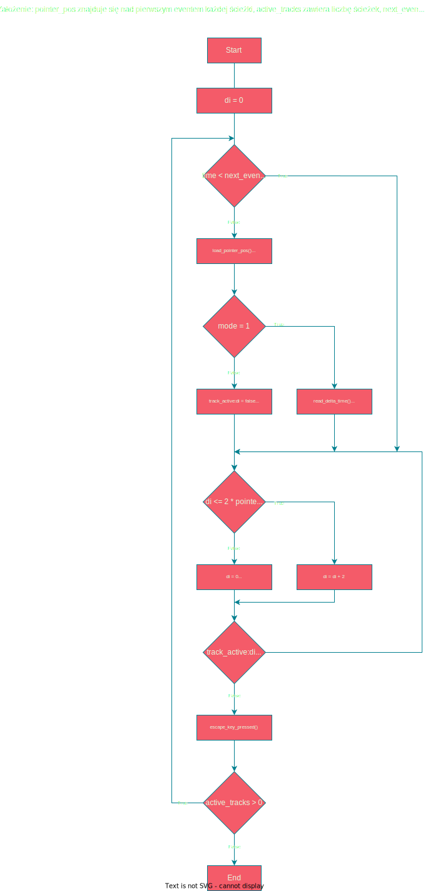

# jukebox

Projekt końcowy z przedmiotu **Architektura Komputerów** (II rok informatyki, Uniwersytet Śląski). Założeniem tego projektu jest stworzenie programu syntezującego melodię odczytaną z dowolnego, prostego formatu plików. Program w całości napisany jest w asemblerze procesora **Intel 8086** w notacji **TASM** oraz nie wykorzystuje żadnych zewnętrznych bibliotek. 

Jako dodatkowe założenie postanowiliśmy zaimplementować możliwość odczytu wielościeżkowych plików w formacie *.mid* oraz skorzystać z syntezatora karty dźwiękowej *ADlib*, którego emulacja jest wspierana przez DOSBoxa.

## Objaśnienie plików MIDI

**MIDI** to uniwersalny format do zapisywania jedno- bądź wielościeżkowych sekwencji melodycznych. Współcześnie jest szeroko stosowany jako podstawowe narzędzie profesjonalnych muzyków do zapisywania swoich melodii, które potem mogą być otwarzane przez wirtualne instrumenty **VST** (a także fizyczne **syntezatory**) a następnie nagrane. Łatwą edycję plików MIDI unożliwia oprogramowanie **DAW** które poza możliwością edycji sekwencji na bierząco pracując z instrumentem wirtualnym, pozwala na zrealizowanie całego utworu muzycznego, łącznie z miksem i masteringiem. 

Plik **.mid** składa się z co najmniej jednej **ścieżki** (ang. *MIDI Track*), a ścieżka słada się ze **zdarzeń MIDI** (ang. *MIDI Event*) oraz / bądź **meta zdarzeń** (ang. *Meta Event*). Instrukcja odtwarzania dźwięku odbywa się na zasadzie zdarzenia *wciśnięcia klawisza* oraz *puszczenia klawisza* tak jak to się odbywa w prawdziwym instrumencie klawiszowym (dźwięk odtwarzany jest tylko od momentu wciśnięcia do momentu puszczenia klawisza). Każde zdarzenie przechowuje informacje: czas od poprzedniego zdarzenia, rodzaj zdarzenia, kanał MIDI (w którym zapisany jest instrument), nutę oraz głośność nuty (ang. *velocity*). Czas między kolejnymi zdarzeniami w ścieżce to **czas delta** (ang. *delta time*), który może być zarówno wartością nuty (długością jej trwania) jak i pauzą między nutami. Tak w skrócie można opisać sposób przechowywania melodii w ścieżce.

Więcej informacji na temat struktury plików MIDI można bez problemu odnaleźć [w internecie](https://web.archive.org/web/20141227205754/http://www.sonicspot.com:80/guide/midifiles.html) oraz [w oficjalnej specyfikacji](https://midi.org/specifications/file-format-specifications/standard-midi-files).

## Sposób działania

By zrozumieć strukturę pliku MIDI warto przejrzeć przewodnik jak [ten](https://web.archive.org/web/20141227205754/http://www.sonicspot.com:80/guide/midifiles.html), bądź sięgnąć po oprogramowanie jak np aplikacja [MIDIopsy](https://github.com/jeffbourdier/MIDIopsy), która potrafi odczytać i wypunktować bajt po bajcie poszczególne elementy.

### Analiza pliku

Program rozpoczyna działanie od nagłówka **MThd** po którym następują podstawowe informacje o pliku MIDI jak na przykład ilość ścieżek. Program pobiera te informacje oraz zapisuje w zmiennych. Cały nagłówek ma **14 bajtów**, na 15 bajcie zawsze zaczyna się pierwsza ścieżka programu.

Każda ścieżka rozpoczyna się od ciągu **MTrk**, po którym 4 następne bajty przechowują informację o tym ile bajtów zawiera dany track. W celu szybkiego odnajdowania ścieżek, program zapisuje adresy (indeks bajtu pliku MIDI) każdego tracku w zmiennej, a te adresy odnajduje poprzez odczytane długości ścieżki znajdujące się w nagłówku tracku. 

Po odnalezieniu adresów wszystkich ścieżek (tylu ile zapisano w nagłówku), program wykonuje wszystkie zdarzenia z wyjątkiem *note on* oraz *note off* by odczytać informacje o tempie, które mogą znajdować się w zasadzie w dowolnej ścieżce. Po tym zdarzeniu, program pyta o numer ścieżki którą następnie odtworzy sekwencyjnie.

### Odczyt zapisu nutowego

Program znając już położenie początku ścieżki, przenosi się do odpowiedniego bajtu programu, pomija kolejne 8 bajtów (by wskaźnik znalazł się nad początkiem pierwszego zdarzenia) oraz rozpoczyna odczyt. 

Każde zdarzenie zaczyna się od czasu delta, więc program wywołuje przerwanie odpowiedzialne za opóźnienie na odpowiedni czas. Gdy czas delta wynosi 0, zdarzenie wykonuje się natychmiastowo. Następny bajt odnosi się do rodzaju zdarzenia. Wyróżniamy **meta events** oraz **track events**. 
- Meta events nie odnoszą się bezpośrednio do ścieżki, a do całego pliku MIDI, dlatego ich długość nie jest z góry narzucona. Mogą one przechowywać na przykład dane tekstowe, ale również ustawienia tempa utworu. Pierwszy bajt meta eventu to **0xFF**, drugi określa typ zdarzenia. Długość meta eventu znajduje się w jego trzecim bajcie, a w czwartym i następnym dane które przechowuje.
- Track events to zdarzenia stricte ścieżki. Zawierają informacje związane bezpośrednio z symulowaniem zachowania kontrolera MIDI, więc umożliwiają nam one na przykład zapisać w pliku MIDI zmianę parametrów syntezatora. Najważniejszym jednak ich zadaniem jest "naciskanie" wirtualnych klawiszy syntezatora, gdyż *Note On* oraz *Note off* są właśnie zdarzeniami ścieżki. Pierwszy bajt zawiera numer zdarzenia (4 starsze bity) oraz numer *kanału MIDI* (4 młodsze bity) a kolejne dwa to parametry. W przypadku zdarzań wciśnięcia/puszczenia klawisza, pierwszy parametr mówi o numerze *nuty midi* (1 - 127), a drugi o parametrze velocity (głośność, którą można bezpośrednio odnieść do mocy wciśnięcia klawisza kontrolera).

Trudnością w odczycie plików midi jest z pewnością zmienna długość zdarzeń oraz w wielu przypadkach czasu delta. W przypadku track eventów należało przygotować przedefiniowane funkcje, które działały w określony sposób by pominąć odpowiednią ilość bajtów przed kolejnym zdarzeniem i odpowiednio je rozpoznać. W przypadku meta eventów sprawa jest prostrza - wystarczy odczytać bajt zawierający długość. Czas delta natomiast wymagał rozpoznania kolejnych bajtów jako jedna, [wielobajtowa zmienna](http://www.ccarh.org/courses/253/handout/vlv/). Sam odczyt nie jest niczym skomplikowanym gdyż wymaga jedynie sprawdzenia czy najstarszy bit w bajcie jest równy 1, jeżeli tak - wartość składa się jeszcze z co najmniej jednego bajtu, jeżeli natomiast nie - delta time już nie zawiera więcej bajtów. Należy zatem odczyt prowadzić z bardzo dużą precyzją. Najmniejszy błąd w tej swerze powoduje "wykolejenie się" wskaźnika ze ścieżki co skutkuje odczytaniem błędnych bajtów i odegraniem nieprawidłowych wartości.

Każde kolejne zdarzenie następuje po poprzednim w pętli aż do wystąpienia meta evetnu **0x2F**, który mówi nam o końcu ścieżki.

### Odczyt wielościeżkowy

Odczyt wielościeżkowy odbywa się na zasadzie prostego algorytmu porównującego. W pętli wykonuje się odczyt eventu oraz czasu delta. Czas delta jest sumowany a następnie proównywany z aktualnym czasem. Jeżeli delta time i aktualny czas są soie równe, odczytywany jest aktualny event oraz delta time następnego eventu. W powyższej pętli jest zagnieżdżona pętla, która steruje który track ma być odtworzony, a na końcu program zatrzymuje swoją pracę na 1 tick. Jeżeli ścieżka miała meta event **0x2F** (koniec ścieżki), zmieniana jest specjalna flaga w data segmencie na 0, co umożliwia programowi pomijanie zakończonych ścieżek (np. z meta eventami, które nie mają żadnego opóźnienia).

Najlepiej sposób działania multitrackingu obrazuje uprostrzony schemat blokowy:

## Czas

Czas jest jednym z najważniejszych, o ile nie najważniejszym aspektem w szeroko pojętej muzyce, więc i pliki MIDI muszą zawierać informacje na jego temat w odniesieniu zarówno do pojedyńczych zdarzeń jak i całego utworu. Pliki MIDI jako punkt odniesienia przyjmują **ósemkę** (quarter note), która stanowi swoisty trzon rytmiki w teorii muzycznej.

W nagłówku pliku (na dwuch bajtach, 9 bajtów po *MThd*) możemy znaleźć informację o tym ile ticków (najmniejszych możliwych odstępów między zdarzeniami) odpowiada ósemce. Dzięki temu jesteśmy w stanie odnieść wirtualny zapis nutowy do teorii muzycznej. Dowolna ścieżka może zawierać również meta event *change tempo* (meta event **0x51**), który odpowiada za zmianę tempa utworu. Zazwyczaj plik MIDI przechowuje tylko jedno takie zdarzenie. W tym evencie mamy zapisany czas, który przypada na jedną ósemkę (w mikrosekundach). Te dwa parametry będą niezbędne do obliczania rzeczywistego delta time, który pozwoli nam na opóźnianie kolejnych zdarzeń w celu usytuowania ich na osi czasu.

# Źródła

- [Tutorial o plikach MIDI](https://web.archive.org/web/20141227205754/http://www.sonicspot.com:80/guide/midifiles.html)
- [Oficjalna specyfikacja plików MIDI](https://midi.org/specifications/file-format-specifications/standard-midi-files)
- [Program do odczytu i wyświetlania danych plików MIDI](https://github.com/jeffbourdier/MIDIopsy), który przydał się przy projektowaniu programu
- [Lista presetów instrumentów](https://github.com/pdewacht/adlipt/blob/master/opl2test/midi_instruments.h) dla syntezatora OPL2
- [Tutorial dotyczący obsługi OPL2](https://www.fit.vutbr.cz/~arnost/opl/opl3.html)
- [Video tutorial dotyczący obsługi OPL2](https://www.youtube.com/watch?v=XKy1cE4EYMk&ab_channel=LateBlt)
- [Projekty leonardo_ono](https://github.com/leonardo-ono?tab=repositories&q=&type=&language=assembly&sort=) jako referencja
- Dudek Andrzej, **Jak pisać wirusy**, Read Me, 1994, 8385769463.
- *Kilka innych ważnych źródeł (uzupełnię i zamieszczę tutaj)*
